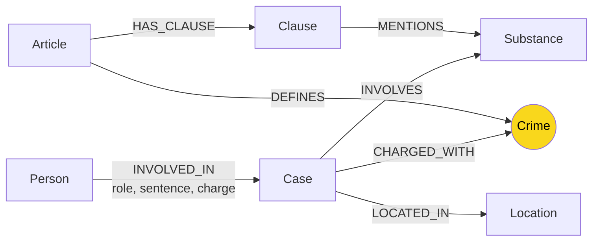

# Thiết kế Ontology — Day 19

**Họ tên:** Đỗ Phúc Hùng  **MSSV:** 2A202602762

**Lựa chọn** (đánh dấu một):
- [x] Dùng ontology gợi ý (có thể chỉnh nhỏ)
- [ ] Tự thiết kế (xét bonus +15, xem `SUBMISSION.md`)

> Hướng dẫn: `LAB_GUIDE.md` Bước 2. Dùng ontology gợi ý thì vẫn phải điền đủ các mục dưới đây bằng lời của bạn.

## 1. Sơ đồ

**Node cầu nối:** `Crime` (ô vàng) — vừa được luật định nghĩa (`DEFINES`) vừa là tội danh mà vụ án bị truy tố (`CHARGED_WITH`).

## 2. Entity types (node labels)

| Label | Ý nghĩa | Khóa định danh (`MERGE` theo) | Properties | Lấy từ KB nào | Trích bằng |
|---|---|---|---|---|---|
| `Article` | Một Điều luật | `id` (VD: "Điều 251 BLHS") | `id`, `title`, `law`, `doc_id` | Luật | Regex (`parse_law_article`) |
| `Clause` | Một khoản trong Điều | `id` (VD: "Điều 251 BLHS khoản 1") | `number`, `penalty`, `text`, `doc_id` | Luật | Regex (tách theo `^1.\s`) |
| `Crime` | Tội danh chuẩn hóa | `name` (VD: "mua bán trái phép chất ma túy") | — | Luật (tiêu đề Điều) | Regex + `normalize_crime` |
| `Case` | Một vụ án trong tin tức | `name` (do LLM đặt) | `name`, `summary`, `date`, `doc_id` | Tin tức | LLM (`extract_news_cases`) |
| `Person` | Người liên quan | `name` | `name`, `aliases` | Tin tức | LLM |
| `Substance` | Chất ma túy | `name` | — | Cả hai | Regex (luật) + LLM (tin) |
| `Location` | Địa điểm vụ án | `name` | — | Tin tức | LLM |

> **Ghi chú về `doc_id`:** Chỉ các node có nguồn gốc từ **một tài liệu** mới mang `doc_id`: `Article`, `Clause`, `Case`. Các node dùng chung (`Crime`, `Substance`, `Location`, `Person`) không mang `doc_id` vì có thể xuất hiện ở nhiều nguồn.

## 3. Relationships

| Type | Từ → Đến | Properties trên cạnh | Ý nghĩa |
|---|---|---|---|
| `DEFINES` | `Article` → `Crime` | — | Điều luật định nghĩa tội danh |
| `HAS_CLAUSE` | `Article` → `Clause` | — | Điều gồm các khoản |
| `MENTIONS` | `Clause` → `Substance` | — | Khoản liệt kê chất bị điều chỉnh |
| `CHARGED_WITH` | `Case` → `Crime` | — | Vụ án bị truy tố tội danh nào |
| `INVOLVES` | `Case` → `Substance` | `amount` | Vụ án liên quan chất gì, bao nhiêu |
| `INVOLVED_IN` | `Person` → `Case` | `role`, `sentence`, `charge` | Người tham gia với vai trò gì |
| `LOCATED_IN` | `Case` → `Location` | — | Vụ án xảy ra ở đâu |

## 4. Node cầu nối giữa 2 KB

- **Node nào:** `Crime` (tội danh chuẩn hóa)
- **Vì sao chọn node này:** Cả hai KB đều chứa tội danh — luật định nghĩa tội qua tiêu đề Điều, tin tức ghi tội danh theo cách báo. Đây là thông tin **duy nhất** xuất hiện ở cả hai KB nên là cầu nối tự nhiên.
- **Cách đảm bảo hai phía khớp tên:**
  1. Luật: lấy tội danh bằng regex từ tiêu đề Điều (`normalize_crime` bỏ "Tội ", chuẩn hóa hoa/thường).
  2. Tin tức: LLM trích xuất rồi qua `link_entity(name, known_crimes)`: chuẩn hóa cả hai phía, khớp chính xác trước, sau đó `difflib.get_close_matches(cutoff=0.8)` cho các biến thể chính tả ("ma tuý" vs "ma túy").
  3. Danh sách tội danh chuẩn được truyền vào prompt LLM để giảm sáng tạo.
- **Khi nào cầu gãy, và xử lý thế nào:**
  - LLM đặt tên không khớp (VD: "Tội mua bán ma túy" thay vì "mua bán trái phép chất ma túy"). → `link_entity` với cutoff 0.8 vẫn bắt được.
  - Trường hợp nghiêm trọng: tội hoàn toàn không nằm trong luật → `link_entity` trả `None`, Case không có cạnh `CHARGED_WITH`, graph không đi qua cầu. Cách phát hiện: truy vấn `MATCH (k:Case) WHERE NOT (k)-[:CHARGED_WITH]->() RETURN k.name, k.doc_id`.
  - Cách giảm thiểu: bổ sung thêm tên tội vào `known_crimes`, hoặc mở rộng danh sách trong prompt LLM.

## 5. Competency questions

| Câu | Đường đi (Cypher pattern) | Trả lời được? |
|---|---|---|
| Q1 (single-hop-law) | `(a:Article {id:'Điều 1 PCMT'})-[:HAS_CLAUSE]->(cl:Clause)` — luật có cấu trúc đều, không cần graph | ✅ Trả lời được từ chunk |
| Q2 (single-hop-news) | `(k:Case)-[:CHARGED_WITH]->(c:Crime), (p:Person)-[:INVOLVED_IN]->(k)` | ✅ Chunk chứa đủ thông tin |
| Q3 (cross-kb) | `(:Person {name:'Lê Minh Thành'})-[:INVOLVED_IN]->(:Case)-[:CHARGED_WITH]->(:Crime)<-[:DEFINES]-(:Article)-[:HAS_CLAUSE]->(:Clause {number:1})` | ✅ Q3 là lý do tồn tại của graph |
| Q4 (cross-kb) | `(:Person {name:'Hoàng Nato'})-[:INVOLVED_IN]->(:Case)-[:CHARGED_WITH]->(:Crime)<-[:DEFINES]-(:Article)-[:HAS_CLAUSE]->(:Clause)` | ⚠️ Q4 được nhưng LLM chọn khoản 1 (mức cơ bản) thay vì khoản 2 (mức cao) — xem lỗi E2 |
| Q5 (cross-kb-multi-hop) | Q3 + lọc theo `Substance {name:'MDMA'}`: `(k)-[:INVOLVES]->(s:Substance {name:'MDMA'})<-[:MENTIONS]-(cl)` | ✅ Lọc khoản theo chất |
| Q6 (aggregation) | `MATCH (k:Case)-[:INVOLVES]->(s:Substance {name:'MDMA'}) RETURN k.name` | ⚠️ Trả lời được về mặt graph, nhưng LLM tạo tên vụ không khớp với benchmark (E1/E3) |

## 6. Quyết định thiết kế và đánh đổi

### 1. Crime là node cầu nối (thay vì Substance hoặc Article)

- **Chọn:** `Crime` là bridge giữa 2 KB. Điều luật định nghĩa tội qua `DEFINES`, vụ án bị truy tố tội qua `CHARGED_WITH`.
- **Phương án khác:** dùng `Article` làm cầu nối (tin tức có thể nhắc "theo Điều 251"). Nhưng báo thường không nhắc số Điều nên approach này hụt nhiều câu.
- **Vì sao chọn:** Crime xuất hiện tự nhiên ở cả hai KB (luật: tiêu đề; tin: tội danh). Đây là entity duy nhất có mặt ở cả hai KB mà không cần suy luận thêm.

### 2. Regex cho luật, LLM cho tin tức

- **Chọn:** Luật trích bằng regex vì cấu trúc rất đều: "Điều X. Tội Y", "1. phạt tù từ ...", "a) ...". Tin tức trích bằng LLM vì văn xuôi tự do.
- **Phương án khác:** Dùng LLM cho luật — tốn thêm token mà kết quả không ổn định hơn (regex cho văn bản có cấu trúc luôn đúng).
- **Đánh đổi:** Nếu luật thay đổi format, regex phá vỡ; LLM có thể thích nghi hơn nhưng đắt hơn và không deterministic.

### 3. Substance không chuẩn hóa qua `link_entity`

- **Chọn:** Substance được so khớp bằng `toLower(name) CONTAINS` trong Cypher, không qua `link_entity` như Crime.
- **Phương án khác:** Gộp các tên đồng nghĩa (VD: "ma túy tổng hợp", "MDMA", "thuốc lắc") dưới một tên chuẩn. Giảm trùng node nhưng tăng phức tạp cho việc ánh xạ ngược.
- **Vì sao:** Tên chất trong SUBSTANCES danh sách tương đối chuẩn, và `toLower` xử lý hoa/thường đủ cho hầu hết trường hợp. Lỗi trùng Substance vẫn xảy ra (xem E3) nhưng không nghiêm trọng với dataset nhỏ.

### 4. Clause là node riêng (thay vì property)

- **Chọn:** Mỗi khoản là một node `Clause` với property `number`, `penalty`, `text`.
- **Phương án khác:** Lưu danh sách khoản nhúng trong Article node (VD: `a.clauses = [...]`). Truy vấn nhanh hơn, graph nhỏ hơn.
- **Vì sao:** Khi đi multi-hop từ Case → Clause (để lấy khung hình phạt), ta cần lọc theo `Clause.number` và `Substance`. Nếu khoản nhúng, Cypher phức tạp hơn nhiều. Đánh đổi: graph to hơn ~18× (18 điều × ~5 khoản = 99 node Clause) nhưng truy vấn sạch hơn.

## 7. So với ontology gợi ý (bắt buộc nếu xét bonus)

> Không xét bonus; dùng ontology gợi ý.

## 8. Hạn chế còn lại

1. **Trùng Substance:** `find_substances` nhạy với hoa/thường, và tên đồng nghĩa không gộp (VD: "cần sa" và "Cần sa" tạo 2 node). Gây phình graph không cần thiết.
2. **Person/Case khóa theo tên LLM:** Nếu LLM đặt tên không nhất quán giữa các lần chạy (VD: "Vụ Hà Nội" vs "Vụ mua bán ở Hà Nội"), graph tạo 2 node Case cho cùng 1 vụ. Hiện tại chưa có cơ chế gộp.
3. **Không mô hình hóa ngưỡng khối lượng:** Luật có khoản a), b), c)… tương ứng với ngưỡng khối lượng. Graph hiện tại chỉ biết khoản nào MENTIONS chất nào, không biết chất đó thuộc ngưỡng nào. Khi trả lời câu hỏi về khung hình phạt, LLM phải suy luận ngưỡng từ tên chất — có thể sai (Q4 lấy khoản 1 thay vì khoản 2).
